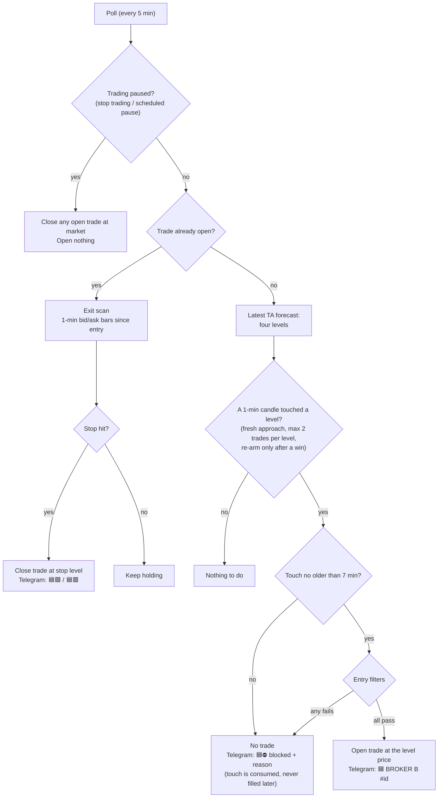

# Broker B

Summary of how Broker B (`broker_b.py`) works. Kept deliberately short — `broker_b.py` and `CLAUDE.md` are the
full spec. Broker B is an automated **paper-trading** engine (1 oz of gold spot, imaginary money) that trades the
price levels of the latest TA forecast. It runs once per poll (every 5 minutes) and is fully independent of Broker A.

## The idea in one line

The latest `ta_forecasts` row gives four levels. When a real 1-minute candle touches one, Broker B enters at that
level, if every entry filter passes, and exits on a trailing stop.

| Rule | Level | Direction |
|---|---|---|
| `TA-Zone-sell` | resistance | Sell (fade) |
| `TA-Zone-buy` | support | Buy (fade) |
| `TA-Breakout-buy` | break above resistance | Buy (follow) |
| `TA-Breakout-sell` | break below support | Sell (follow) |

## How a poll works

## Entry filters

All of these gate **new entries only**, never exits. Each one fails open (no block) if its data is unavailable. The
DXY / ADX / RSI / ATR values below are the defaults from `config.py`; the live values are the newest row of the
`block_rules` table, which `start BRA` updates (see `docs/block-rules-analysis.md`).

1. **Trading hours** — 7am–5pm ET, weekdays.
2. **DXY** — skip a Buy if DXY rose, or a Sell if DXY fell, by its own 15-min threshold (a fresh headwind).
3. **ADX** — fades are blocked when ADX ≥ 25 and the trend (+DI vs −DI) is against the fade — a sell fade only in an up-trend, a buy fade only in a down-trend; breakouts are blocked when ADX < 20 (no trend).
4. **RSI exhaustion** — breakouts blocked when RSI is already past 70/30; fades blocked at RSI ≥ 68 (sell) / ≤ 32 (buy).
   Waived when ADX ≥ 25.
5. **Volatility** — every rule is blocked when 15-min ATR(14) ≥ $12 (the $10 stop would be inside normal noise).

## Exit

There is no take-profit. The stop starts at **$10 below entry** (`make SL <n>` changes it) and, once the trade is
**$7 in profit**, trails **$7 behind** the best price (`make trail <activation> <distance>` changes it). The exit is
found by replaying every 1-minute bar since entry, so a spike that touched the stop between polls still closes at the
true level. Prices are side-correct: a Buy enters on the ask and exits on the bid, a Sell the opposite.

**Fade profit lock (from 5 Oct 2026, fade rules only):** when a `TA-Zone-sell` / `TA-Zone-buy` trade reaches the *opposite* fade
level (a sell reaching the buy fade support, a buy reaching the sell fade resistance), the stop jumps to that level, locking that
profit, and then trails $5 behind the best price. If price comes back through the level, the trade closes there. For example, a sell
from 4164.37 that reaches the 4150 support has 4150 as its stop (+$14.37), then 5 above each new low. Breakout trades keep the
ordinary trail.
The opposite level is read from the **latest** forecast, so if a newer TA run moves it the lock follows (a level not beyond the entry
in the trade's favour is ignored).

## Good to know

- **Blocked-touch notices repeat on a fresh touch** of the same level, at most one per 30 minutes per level and reason (a level that stays past its trigger doesn't spam every poll).
- **One position at a time**, across all four rules. If another level is touched while a trade is open, a ⛔ Telegram notice says so at the next poll (the touch is not filled later).
- **Telegram commands** (`docs/telegram-commands.md`) can open or close a Broker B trade by hand, pause trading, or
  `rearm levels` to let every level trade again.
- Every trade stores an `entry_context` snapshot (RSI, ADX, ATR, DXY move, spread, …) in `broker_b_trades`, used to
  judge which rules and filters actually work.
- A daily review (after 5pm ET) summarises each day's trades and is sent to Telegram.
