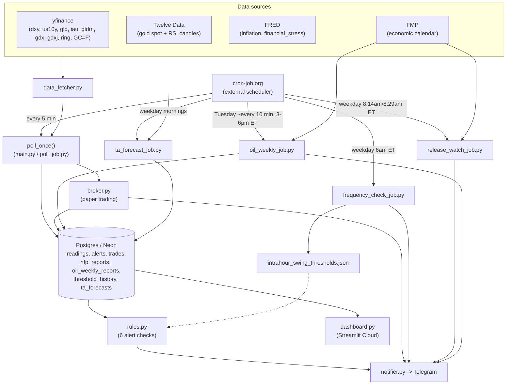

# Logical Diagram

High-level view of how data moves through the system. Kept deliberately summarized — see `CLAUDE.md`
for the full breakdown of each piece.

**Step by step:**

1. **cron-job.org -> Poll (every 5 min)** — an external cron service is the real scheduler, since
   GitHub Actions' own `schedule:` trigger proved unreliable.
2. **cron-job.org -> frequency_check_job.py (weekday mornings)** — same external-cron pattern, once a
   day on weekdays only (6 AM ET, Monday-Friday) instead of every 5 minutes.
3. **Sources -> data_fetcher.py** — yfinance, Twelve Data, and FRED are three unrelated APIs, each
   wrapped the same way (`retry.with_retries()`).
4. **data_fetcher.py -> poll_once()** — `main.py` (local, continuous loop) and `poll_job.py` (cloud,
   one-shot) both call this same function so the logic isn't duplicated.
5. **poll_once() -> Postgres** — prices are saved *before* alerts are checked, so each alert compares
   against the previous poll, not the one just saved.
6. **Postgres -> rules.py** — the six alert checks read back what was just saved plus recent history
   (e.g. the intrahour-swing windows).
7. **rules.py -> Telegram** — any rule that fires sends a message immediately via `notifier.py`.
8. **poll_once() -> broker.py** — right after alerts are saved, the automated paper-trading engine
   checks whether a recent alert should open/close a trade.
9. **broker.py -> Postgres / Telegram** — trade state is written to the `trades` table (poll runs are
   stateless, so this is the only place state persists) and every open/close is also messaged to
   Telegram.
10. **Postgres -> dashboard.py** — the Streamlit dashboard reads the same tables independently, in a
    completely separate deployment, so it never touches the poll/alert path directly.
11. **frequency_check_job.py -> intrahour_swing_thresholds.json** — each weekday morning, all
    twenty-four thresholds are recomputed fresh (the average companion swing of each indicator when
    gold itself moves $5/$10/$15) and whichever changed are rewritten in place (a PR is opened and
    merged automatically).
12. **frequency_check_job.py -> Telegram** — a report is sent every run either way, naming all
    twenty-four indicator/window combinations (GLD/IAU/GLDM/GDX/GDXJ/RING/DXY/US10Y x 15/10/5 min) and
    whether each changed.
13. **intrahour_swing_thresholds.json -> rules.py** (dotted) — the next poll picks up whatever
    thresholds are currently on disk; this isn't a live data flow, just a config dependency.
14. **cron-job.org -> release_watch_job.py (weekday 8:14am/8:29am ET)** — a few minutes before ADP's
    8:15am and NFP's 8:30am ET scheduled releases; unlike every other scheduled job here, this one
    isn't a pure one-shot — it burst-polls FMP internally for up to a few minutes once triggered, since
    cron-job.org itself can't reliably schedule sub-minute triggers.
15. **FMP -> release_watch_job.py -> Telegram** — the moment FMP's economic-calendar `actual` field
    for today's matching release goes from `null` to a real number, a same-minute alert is sent,
    independent of FRED's own ingestion lag (which the main `Poll` -> `rules.py` path still depends on
    for `adp_employment`/`nonfarm_payrolls`). Deliberately not connected to Postgres — this job doesn't
    write `nfp_reports`/`adp_reports` itself, see CLAUDE.md's "Same-minute release detection".
16. **cron-job.org -> oil_weekly_job.py (Tuesday, repeated)** — unlike every other trigger here, this
    one fires many times across a single multi-hour window (~3pm-6pm ET) rather than once, since API
    Crude Oil Stock Change's real release minute is far less predictable than ADP/NFP's. Each
    invocation is a plain one-shot (check FMP once, act or exit) — no internal polling loop.
17. **FMP -> oil_weekly_job.py -> Postgres / Telegram** — the moment `actual` appears for a week not
    already in `oil_weekly_reports`, this job both alerts and records the release in the same step
    (unlike release_watch_job.py, there's no other mechanism tracking this indicator, so this job owns
    both), then every subsequent invocation that same Tuesday sees the week is already recorded and
    no-ops.
18. **cron-job.org -> ta_forecast_job.py -> Postgres (weekday mornings)**: builds an XAU/USD technical
    forecast from Twelve Data 15min/1h/4h/daily candles (indicator snapshot, level zones, a four-scenario
    plan, and a candle-graded review of the previous forecast) and writes it to `ta_forecasts`. No
    Telegram message. See `docs/technical-analyst-forecast-log.md`.
