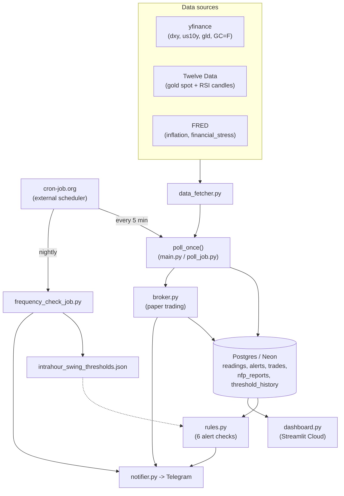

# Logical Diagram

High-level view of how data moves through the system. Kept deliberately summarized — see `CLAUDE.md`
for the full breakdown of each piece.

**Step by step:**

1. **cron-job.org -> Poll (every 5 min)** — an external cron service is the real scheduler, since
   GitHub Actions' own `schedule:` trigger proved unreliable.
2. **cron-job.org -> frequency_check_job.py (nightly)** — same external-cron pattern, once a day
   instead of every 5 minutes.
3. **Sources -> data_fetcher.py** — yfinance, Twelve Data, and FRED are three unrelated APIs, each
   wrapped the same way (`retry.with_retries()`).
4. **data_fetcher.py -> poll_once()** — `main.py` (local, continuous loop) and `poll_job.py` (cloud,
   one-shot) both call this same function so the logic isn't duplicated.
5. **poll_once() -> Postgres** — prices are saved *before* alerts are checked, so each alert compares
   against the previous poll, not the one just saved.
6. **Postgres -> rules.py** — the six alert checks read back what was just saved plus recent history
   (e.g. the intrahour-swing windows).
7. **rules.py -> Telegram** — any rule that fires sends a message immediately via `notifier.py`.
8. **poll_once() -> broker.py** — right after alerts are saved, the automated paper-trading engine
   checks whether a recent alert should open/close a trade.
9. **broker.py -> Postgres / Telegram** — trade state is written to the `trades` table (poll runs are
   stateless, so this is the only place state persists) and every open/close is also messaged to
   Telegram.
10. **Postgres -> dashboard.py** — the Streamlit dashboard reads the same tables independently, in a
    completely separate deployment, so it never touches the poll/alert path directly.
11. **frequency_check_job.py -> intrahour_swing_thresholds.json** — nightly, off-target thresholds are
    re-tuned and rewritten in place (a PR is opened and merged automatically).
12. **frequency_check_job.py -> Telegram** — a report is sent every run either way, naming all nine
    indicator/window combinations and whether each changed.
13. **intrahour_swing_thresholds.json -> rules.py** (dotted) — the next poll picks up whatever
    thresholds are currently on disk; this isn't a live data flow, just a config dependency.
