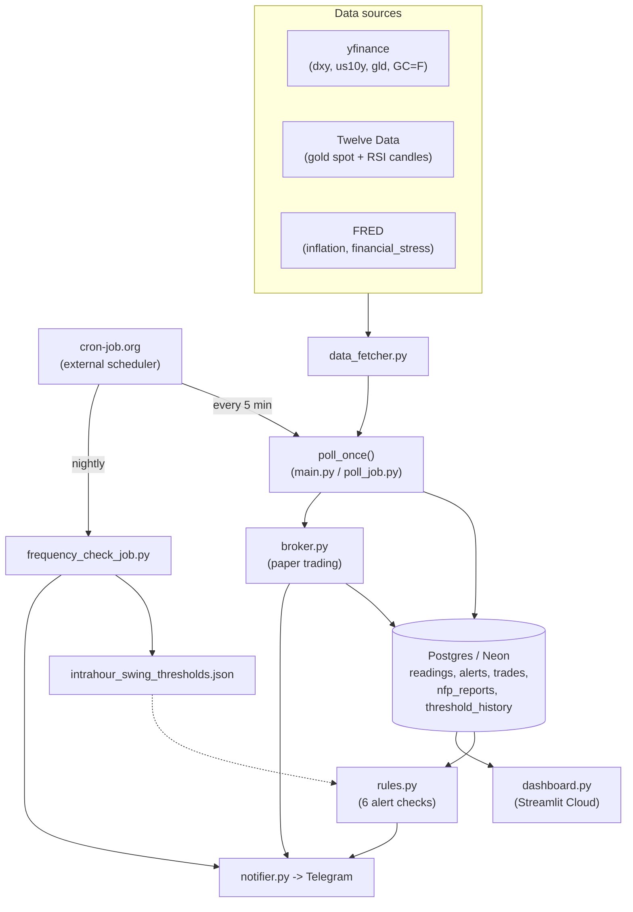

# Logical Diagram

High-level view of how data moves through the system. Kept deliberately summarized — see `CLAUDE.md`
for the full breakdown of each piece.

**Read it as:** an external cron service drives polling since GitHub Actions' own `schedule:` trigger
proved unreliable; each poll fetches prices from three different sources, saves them to Postgres, runs
them through the alert rules, and fans out to Telegram (direct alerts) and the broker (automated paper
trades). The dashboard reads the same Postgres tables independently. Nightly, a separate job backtests
and re-tunes the intrahour-swing thresholds those rules use.
