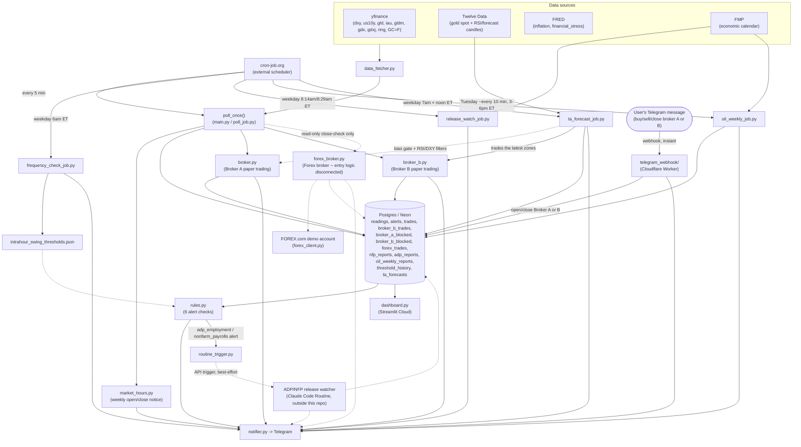

# Logical Diagram

High-level view of how data moves through the system. Kept deliberately summarized — see `CLAUDE.md`
for the full breakdown of each piece.

**Step by step:**

1. **cron-job.org -> Poll (every 5 min)** — an external cron service is the real scheduler, since
   GitHub Actions' own `schedule:` trigger proved unreliable.
2. **cron-job.org -> frequency_check_job.py (weekday mornings)** — same external-cron pattern, once a
   day on weekdays only (6 AM ET, Monday-Friday) instead of every 5 minutes.
3. **Sources -> data_fetcher.py** — yfinance, Twelve Data, and FRED are three unrelated APIs, each
   wrapped the same way (`retry.with_retries()`).
4. **data_fetcher.py -> poll_once()** — `main.py` (local, continuous loop) and `poll_job.py` (cloud,
   one-shot) both call this same function so the logic isn't duplicated.
5. **poll_once() -> market_hours.py** — checked before the price fetch every poll, so it still fires
   even if prices are briefly unavailable right at the boundary; sends a one-off Telegram message when
   the market closes for the week (Friday 5pm ET) and reopens (Sunday 6pm ET).
6. **poll_once() -> Postgres** — prices are saved *before* alerts are checked, so each alert compares
   against the previous poll, not the one just saved.
7. **Postgres -> rules.py** — the six alert checks read back what was just saved plus recent history
   (e.g. the intrahour-swing windows).
8. **rules.py -> Telegram** — any rule that fires sends a message immediately via `notifier.py` (the
   intrahour-swing mechanism is the one exception — it still saves every alert, since Broker A/B's entry
   rules depend on it, but doesn't send it to Telegram).
9. **rules.py -> routine_trigger.py -> Routine (dotted, best-effort)** — an ADP/NFP alert also POSTs to
   a Claude Code Routine's trigger endpoint so it re-checks FRED and sends its own recommendation within
   the same ~5-minute cycle instead of waiting up to an hour; both env vars are optional and any failure
   here is caught so it never blocks the rest of the poll. The Routine itself lives outside this repo.
10. **poll_once() -> broker.py (Broker A)** — right after alerts are saved, this automated engine checks
    whether the last 10 minutes of intrahour-swing alerts satisfy `Consensus5of7-buy`/`-sell`, gated by
    the latest `ta_forecasts` row's bias score plus RSI-exhaustion/DXY-confirmation filters, and
    open/closes a position in `trades` accordingly. Every open/close, and every filter-blocked signal, is
    also sent to Telegram (deduplicated via `broker_a_blocked`).
11. **poll_once() -> broker_b.py (Broker B)** — a second, independent engine (its own `try/except` so a
    problem here can't break the rest of the poll) that trades the latest `ta_forecasts` row's four price
    zones directly, gated by trading-hours/DXY/RSI filters instead of Broker A's bias gate. Writes to its
    own `broker_b_trades` table, and sends blocked-entry notices via `broker_b_blocked`.
12. **poll_once() -> forex_broker.py (dotted, read-only)** — only the close-reconciliation path
    (`check_forex_closes()`) is wired into the poll; it never places or closes a real order itself, just
    reconciles `forex_trades` against the FOREX.com demo account's open positions and alerts on close.
    The full entry logic (`check_forex_broker_trades()`) exists but stays deliberately disconnected
    unless explicitly asked to be wired in.
13. **Telegram -> telegram_webhook/ (Cloudflare Worker)** — the one inbound path in the whole project,
    and the only piece not scheduled by cron-job.org/GitHub Actions at all: Telegram pushes a message to
    this Worker's fixed URL the instant it's sent (`setWebhook`, not polling), and a recognized "buy/sell
    broker a/b" or "close broker a/b" command writes straight into `trades`/`broker_b_trades` — the same
    tables Broker A/B's own automated logic uses — then replies on Telegram. Runs entirely outside the
    5-minute poll cycle.
14. **Postgres -> dashboard.py** — the Streamlit dashboard reads the same tables independently, in a
    completely separate deployment, so it never touches the poll/alert path directly.
15. **frequency_check_job.py -> intrahour_swing_thresholds.json** — each weekday morning, all
    twenty-four thresholds are recomputed fresh (the average companion swing of each indicator when
    gold itself moves $5/$10/$15) and whichever changed are rewritten in place (a PR is opened and
    merged automatically).
16. **frequency_check_job.py -> Telegram** — a report is sent every run either way, naming all
    twenty-four indicator/window combinations (GLD/IAU/GLDM/GDX/GDXJ/RING/DXY/US10Y x 15/10/5 min) and
    whether each changed.
17. **intrahour_swing_thresholds.json -> rules.py** (dotted) — the next poll picks up whatever
    thresholds are currently on disk; this isn't a live data flow, just a config dependency.
18. **cron-job.org -> release_watch_job.py (weekday 8:14am/8:29am ET)** — a few minutes before ADP's
    8:15am and NFP's 8:30am ET scheduled releases; unlike every other scheduled job here, this one
    isn't a pure one-shot — it burst-polls FMP internally for up to a few minutes once triggered, since
    cron-job.org itself can't reliably schedule sub-minute triggers.
19. **FMP -> release_watch_job.py -> Telegram** — the moment FMP's economic-calendar `actual` field
    for today's matching release goes from `null` to a real number, a same-minute alert is sent,
    independent of FRED's own ingestion lag (which the main `Poll` -> `rules.py` path still depends on
    for `adp_employment`/`nonfarm_payrolls`). Deliberately not connected to Postgres — this job doesn't
    write `nfp_reports`/`adp_reports` itself, see CLAUDE.md's "Same-minute release detection".
20. **cron-job.org -> oil_weekly_job.py (Tuesday, repeated)** — unlike every other trigger here, this
    one fires many times across a single multi-hour window (~3pm-6pm ET) rather than once, since API
    Crude Oil Stock Change's real release minute is far less predictable than ADP/NFP's. Each
    invocation is a plain one-shot (check FMP once, act or exit) — no internal polling loop.
21. **FMP -> oil_weekly_job.py -> Postgres / Telegram** — the moment `actual` appears for a week not
    already in `oil_weekly_reports`, this job both alerts and records the release in the same step
    (unlike release_watch_job.py, there's no other mechanism tracking this indicator, so this job owns
    both), then every subsequent invocation that same Tuesday sees the week is already recorded and
    no-ops.
22. **cron-job.org -> ta_forecast_job.py -> Postgres / Telegram (weekdays 7am and 12pm ET)**: builds an
    XAU/USD technical forecast from Twelve Data 15min/1h/4h/daily candles (indicator snapshot, level
    zones, a four-scenario plan, and a candle-graded review of the previous forecast) and writes it to
    `ta_forecasts`, then sends the same text to Telegram. Both Broker A (bias gate + entry filters) and
    Broker B (the four scenarios it trades) read this same table. See
    `docs/technical-analyst-forecast-log.md`.
